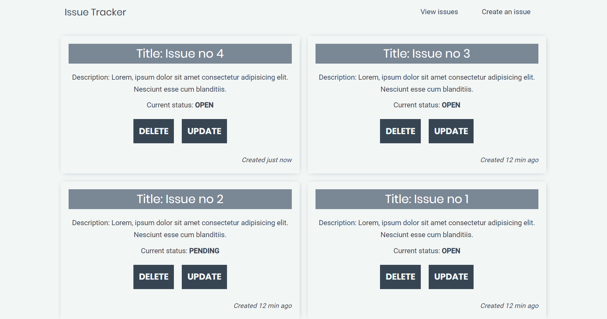

<p align="center">
  <a href="#">
    
  </a>
</p>
<h1 align="center">
  Issue Tracker
</h1>

## Usage

```js
git clone https://github.com/jsberlanga/issue-tracker-v2.git
```

Then cd into server and client folders and install the dependencies.

```js
cd client
npm run app
```

Then open http://localhost:3000/ to see the issue tracker app.
